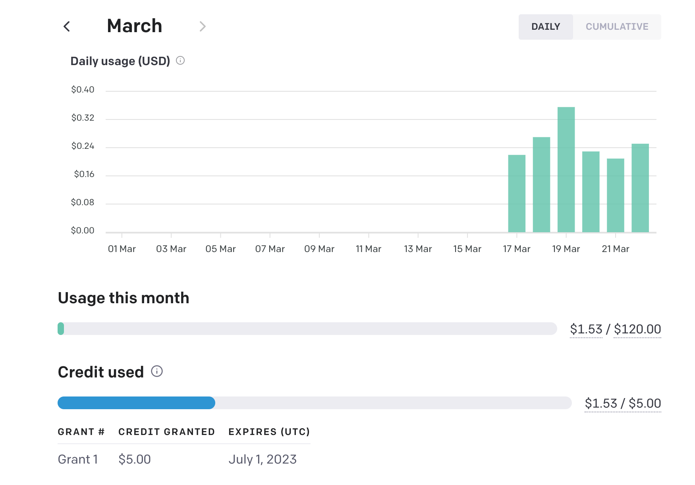

# ThanksALotGuys

给捐款的各位磕头了

通过clone[川虎ChatGPT](https://github.com/GaiZhenbiao/ChuanhuChatGPT)项目，结合我自己申请的api，我做了一个可以免费使用openai服务的站点：
[快来试试吧](https://buptfreechat.win)

## Api使用和捐赠情况

### 流量使用情况：

### 

API费用：累计使用`1.53`美元，目前还有5美元的免费额度没有用完。

固定费用：Bandhost 的 CN2 主机，年费49美元（已付）。cloudflare的域名，年费3.9美元（已付）。某三流脚本小子的头发 100 根（已付）

固定费用日均0.1449315068美元。

截至`2023`年`3`月`22`日，总费用：`1.6749315068 `美元，约合`11.53`人民币

### 捐赠情况

截至2023年3月22日，累计接受到16.76人民币

### 联系方式

如果我侵犯到了您的权益，请您立即联系我：

brook1711@bupt.edu.cn

### 捐赠二维码：

